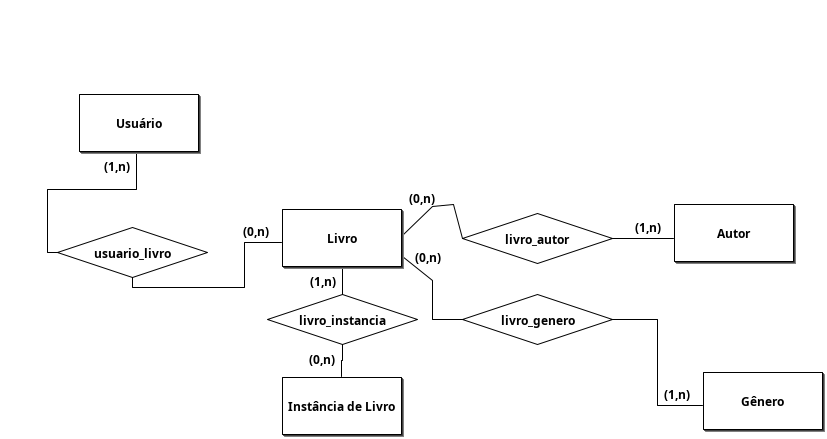

# Documento de Visão

Documento construído a partido do **Modelo BSI - Doc 001 - Documento de Visão** que pode ser encontrado no
link: https://docs.google.com/document/d/1DPBcyGHgflmz5RDsZQ2X8KVBPoEF5PdAz9BBNFyLa6A/edit?usp=sharing

## Equipe e Definição de Papéis

Membro     |     Papel                             |   E-mail                      |
---------  | ------------------------------------- | ----------------------------- |
Taciano    | Cliente                               | taciano@bsi.ufrn.br
Amaro      | Analista, Desenvolvedor e QA/Testador | porfirio.amaro.013@ufrn.gov.br

### Matriz de Competências

Membro     |     Competências             |
---------  | ---------------------------- |
Amaro      | Gestor, Testador e Desenvolvedor Python |

## Perfis dos Usuários

O sistema deverá ser usado por usuários de uma biblioteca. Deverá haver os seguintes perfis/atores:

Perfil                                 | Descrição   |
-------------------------------------- | ----------- |
Administrador                          | Este usuário realiza os cadastros de livros generos autores e instancias, e pode realizar qualquer função.
Usuário                                | Este usuário utiliza o sistema apenas para consultar os seus emprestimos de livros.

## Lista de Requisitos Funcionais

Requisito                             | Descrição   | Ator       |
------------------------------------- | ----------- | ---------- |
RF001 - Manter cadastro de livros  | Manter um cadastro de livros com os atributos nome, autor, genero e ISNP | Administrador |
RF002 - Manter cadastro de gêneros | Manter um cadastro de agente com os atributos matricula, nome e zona. | Administrador |
RF003 - Manter cadastro de instâncias | Manter cadastro das zonas com os atributos numero e quarteirões. | Administrador |
RF004 - Manter cadastro de usuários | Manter um cadastro de usuário com nome. | Administrador |
RF005 - Realizar emprestimo | O administrador deve realizar um emprestimo para o usuário | Administrador |
RF006 - Consultar emprestimo | Depois de realizar o login o usuário deve conseguir consultar um livro emprestado | Usuário |

## Modelo Logico

Abaixo apresentamos o modelo logico.

 

#### Descrição das Entidades

## Lista de Requisitos Não-Funcionais

Requisito                                 | Descrição   |
---------                                 | ----------- |
RNF001 - Deve ser acessível via navegador | Deve abrir perfeitamento no Firefox e no Chrome. |
RNF002 - Consultas deve ser eficiente | O sistema deve executar as consultas em milessegundos |
RNF003 - Log e histórico de acesso e funções | Deve manter um log de todos os acessos e das funções executadas pelo usuário |
RNF004 - Interface amigável | Deve ter um interface amigável construída com Bulma/Bootstrap |

## Riscos

Mapeamento de riscos do projeto, as possíveis soluções e os responsáveis.

Data   | Risco  | Prioridade | Responsável | Status | Providência/Solução |
------ | ------ | ---------- | ----------- | ------ | ------------------- |
10/11/2023 | Não aprendizado das ferramentas utilizadas pelos componentes do grupo | Alta | Todos | Vigente | Reforçar estudos sobre as ferramentas e aulas com a integrante que conhece a ferramenta |
10/11/2023 | Ausência por qualquer motivo do cliente | Média | Gerente | Vigente | Planejar o cronograma tendo em base a agenda do cliente |
10/11/2023 | Divisão de tarefas mal sucedida | Baixa | Gerente | Vigente | Acompanhar de perto o desenvolvimento de cada membro da equipe |
10/11/2023 | Implementação de protótipo com as tecnologias | Alto | Todos | Resolvido | Encontrar tutorial com a maioria da tecnologia e implementar um caso base do sistema |

### Referências